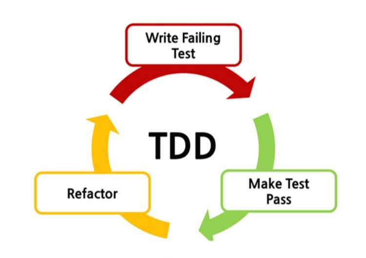

# [인프런 - Practical Testing: 실용적인 테스트 가이드](https://inf.run/wRaT)

---

## 0. 개요

### 목표

```text
- 프로덕션 코드의 품질을 보장하는 탄탄한 테스트 코드 작성법
- 스프링 & JPA 기반 프로젝트에서의 테스트 코드 작성법
- JUnit5
- Mockito
- Spring REST Docs
```

### 테스트는 왜 필요할까?

```text
프로덕션 코드가 개발되고, 확장되면서
- 커버할 수 없는 영역이 발생
- 경험과 감에 의존하게 됨
- 유지보수 어려움
- 늦은 피드백
- 소프트웨어의 신뢰성 하락

테스트를 통해 얻는 것
- 빠른 피드백
- 자동화
- 안정감

테스트 코드를 작성하지 않는다면
- 변화가 생기는 매순간마다 발생할 수 있는 모든 케이스를 고려해야함.
- 변화가 생기는 매순간마다 모든 팀원이 동일한 고민을 해야함.
- 빠르게 변화하는 소프트웨어의 안정성을 보장할 수 없음.

테스트 코드가 병목이 된다면
- 프로덕션 코드의 안정성을 제공하기 힘들어짐.
- 테스트 코드 자체가 유지보수하기 어려운, 새로운 짐덩이가 됨.
- 잘못된 검증이 이뤄질 수 있음.

올바른 테스트 코드
- 자동화 테스트로 비교적 빠른 시간 안에 버그를 발견할 수 있고, 수동 테스트에 드는 비용을 크게 절약할 수 있다.
- 소프트웨어의 빠른 변화를 지원.
- 팀원들의 집단 지성을 팀 차원의 이익으로 승격시킨다.
- 가까이 보면 느리지만, 멀리 보면 가장 빠르다.
```

---

## 1. 단위테스트

### 단위테스트

```text
- 클래스 또는 메서드의 작은 코드 단위를 검증하는 테스트
    - 네트워크 등 외부상황에 의존하지 않아야함.
- 다른 테스트에 비해 검증속도가 빠르고 안정적
```

### JUnit5

[JUnit5](https://junit.org/junit5/)

```text
- XUnit - Kent Beck
- 단위 테스트를 위한 테스트 프레임워크
```

### AssertJ

[AssertJ](http://joel-costigliola.github.io/assertj/)

```text
- 테스트 코드 작성을 원활하게 돕는 테스트 라이브러리
- 메서드 체이닝 지원을 통한 높은 가독성
- 풍부한 API
```

### 테스트 케이스 세분화

```text
- 질문하기
    - 암묵적이거나 아직 드러나지 않은 요구사항이 있는가?
- 해피 케이스
    - 요구사항을 만족하는 케이스
- 예외 케이스
    - 엣지 케이스
- 경계값 테스트
    - 범위(이상, 이하, 초과, 미만), 구간, 날짜 등
```

테스트 케이스를 세분화 할 수 있는 시야가 중요

### 테스트 하기 어려운 영역을 분리

```text
- 관측할 때마다 다른 값에 의존하는 코드(현재 날짜/시간, 랜덤 값, 전역 변수/함수, 사용자 입력 등)
- 외부 세계에 영향을 주는 코드(표준 출력, 이메일 발송, 데이터베이스 기록 등)
```

#### Before) 테스트하기 어려운 코드

```java
    @Test
	void createOrderWithCurrentTime(){
		CafeKiosk cafeKiosk=new CafeKiosk();
		Americano americano=new Americano();

		cafeKiosk.add(americano);

		Order order=cafeKiosk.createOrder(LocalDateTime.of(2023,9,25,10,0));

		assertThat(order.getBeverageList()).hasSize(1);
		assertThat(order.getBeverageList().get(0).getName()).isEqualTo("Americano");
		}
```

#### After) 시간이라는 값을 외부로 분리한 테스트 코드

```java
    @Test
	void createOrderOutsideOpenTime(){
		CafeKiosk cafeKiosk=new CafeKiosk();
		Americano americano=new Americano();

		cafeKiosk.add(americano);
		assertThatThrownBy(()->cafeKiosk.createOrder(LocalDateTime.of(2023,9,25,9,59)))
		.isInstanceOf(IllegalArgumentException.class)
	.hasMessage("주문 가능한 시간이 아닙니다. 관리자에게 문의하세요.");

	}
```

---

## 2. TDD

### TDD: Test Driven Development



```text
프로덕션 코드보다 테스트 코드를 먼저 작성하여 테스트가 구현 과정을 주도하도록 하는 방법론.  

TDD 기본 과정 (레드-그린-리팩토링)
- RED : 실패하는 테스트를 작성한다.
- GREEN : 빠른 시간내에 테스트를 통과하는 최소한의 코드를 작성한다.
- REFACTOR : 구현 코드를 개선하고 테스트 통과를 유지시킨다.

TDD의 핵심 가치
- 빠르고 잦은 피드백

프로덕션 코드 구현 후 테스트 코드 작성
- 테스트 코드의 누락 가능성
- 특정 테스트 케이스만 검증, 구현할 가능성
    - 해피 케이스만 구현하는 등
- 잘못된 구현을 늦게 발견할 가능성

테스트 코드 작성 후 프로덕션 코드 구현
- 복잡도가 낮은, 테스트 가능한 코드를 작성할 수 있음
    - 코드가 유연하고, 유지보수가 쉬움
- 쉽게 발견하기 힘든 엣지 케이스를 놓치지 않게 해준다.
- 구현에 대한 빠른 피드백
- 과감한 리팩토링 시도 가능
```


---